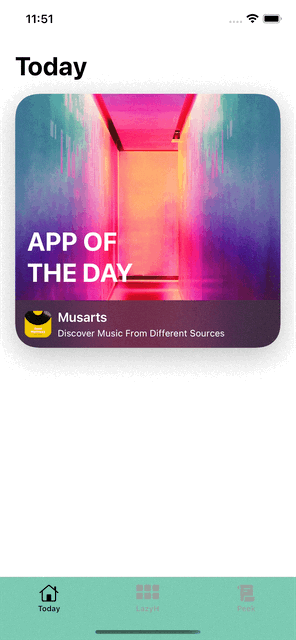

# SwiftUI App Store Today Mock

App store today page animation created in SwiftUI, using matchedGeometryEffect.
 

# Menu
* [Screenshots](#screenshots)
* [Source](#source)
* [Contributions](#contributions)
* [Contact](#contact)

# Screenshots

# Source
Follow the SwiftUI tutorial livestream by [MengTo](https://twitter.com/MengTo), fully developed with SwiftUI.

# Contributions

* All kinds of contributions (enhancements, new features, documentation & code improvements, issues & bugs reporting & todo task) are welcome. Let's make it better.

# Contact
Created by [Terry Kuo](https://twitter.com/ArgonYoYo) - feel free to contact me!
